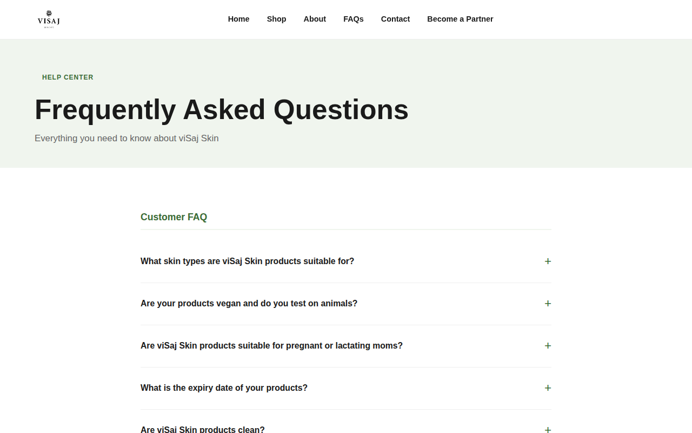
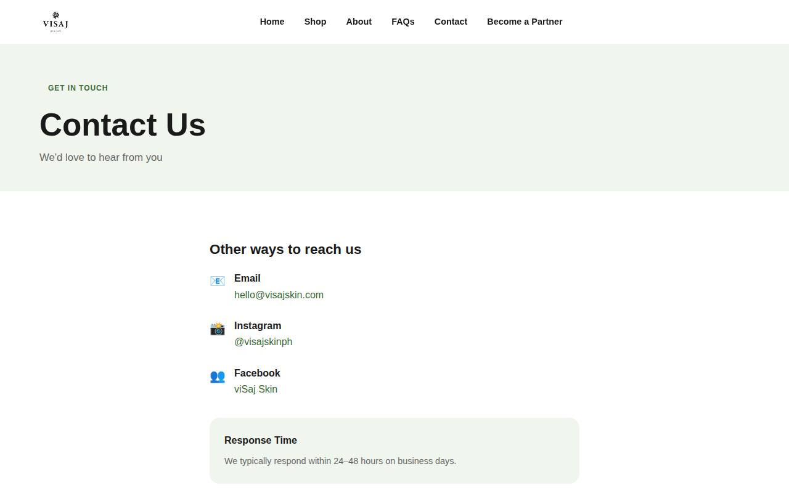

# viSaj Skin — Static Website

> Clean, eco-friendly skincare rooted in Filipino values. Ceremonial matcha & gentle actives for skin that truly glows.

A fully static export of [visajskin.com](https://visajskin.com), ready for deployment on **Cloudflare Pages** (or any static host). No WordPress, no server-side code, no database — just HTML, CSS, and images.

---

## 📸 Screenshots

### Homepage


### Shop


### Product Page — Matcha Detox Soap


### Product Page — Le Blanc Bright Serum


### About


### FAQs


### Contact


### Become a Distributor


---

## 🗂 Pages

| Page | Path |
|------|------|
| Homepage | `/index.html` |
| Shop | `/shop/index.html` |
| Matcha Detox Soap | `/product/matcha-detox-soap/` |
| Matcha Detox Scrub | `/product/matcha-detox-scrub/` |
| Matcha Detox Lotion | `/product/matcha-detox-lotion/` |
| Le Blanc Bright Soap | `/product/le-blanc-soap/` |
| Le Blanc Bright Serum | `/product/le-blanc-serum/` |
| About | `/about/` |
| FAQs | `/faqs/` |
| Contact | `/contact/` |
| Become a Partner | `/become-a-distributor/` |
| Find a Partner | `/find-a-distributor/` |
| Privacy Policy | `/privacy-policy/` |
| Terms & Conditions | `/terms-and-conditions/` |
| Returns & Refunds | `/returns-and-refund-policy/` |
| 404 | `/404.html` |

---

## 🚀 Deploying to Cloudflare Pages

### First-time setup

1. Push this repo to GitHub
2. Go to [dash.cloudflare.com](https://dash.cloudflare.com) → **Pages** → **Create a project** → **Connect to Git**
3. Select `deecreatemnl/visaj-skin-website`
4. Set the following build settings:
   - **Build command:** *(leave blank)*
   - **Build output directory:** `/`
5. Click **Save and Deploy**

Cloudflare Pages will auto-deploy on every future `git push`.

### Updating the site

```bash
# Clone the repo
git clone https://github.com/deecreatemnl/visaj-skin-website.git
cd visaj-skin-website

# Clear old files
git rm -rf .
git clean -fd

# Extract updated ZIP and copy files in
unzip ~/Downloads/visaj-skin-github.zip
cp -r visaj-static/. .
rm -rf visaj-static

# Push
git add -A
git commit -m "Your update message here"
git push origin main
```

---

## 🛒 Products

| Product | Line | Price |
|---------|------|-------|
| Matcha Detox Soap | Matcha Line | ₱219 |
| Matcha Detox Scrub | Matcha Line | ₱565 |
| Matcha Detox Lotion | Matcha Line | ₱548 |
| Le Blanc Bright Soap | Le Blanc Line | ₱252 |
| Le Blanc Bright Serum | Le Blanc Line | ₱273 |

---

## 📁 Project Structure

```
visaj-static/
├── index.html                  # Homepage
├── shop/
├── about/
├── contact/
├── faqs/
├── become-a-distributor/
├── find-a-distributor/
├── product/
│   ├── matcha-detox-soap/
│   ├── matcha-detox-scrub/
│   ├── matcha-detox-lotion/
│   ├── le-blanc-soap/
│   └── le-blanc-serum/
├── privacy-policy/
├── terms-and-conditions/
├── returns-and-refund-policy/
├── images/                     # All product & brand images
├── css/                        # Stylesheet
├── js/                         # Site scripts
├── 404.html                    # Custom 404 page
├── _redirects                  # Cloudflare Pages redirects
├── _headers                    # Cloudflare Pages cache/security headers
├── robots.txt
└── sitemap.xml
```

---

## 🔗 Social & Contact

| Channel | Link |
|---------|------|
| Instagram | [@visajskinph](https://www.instagram.com/visajskinph) |
| Facebook | [visajskinph](https://www.facebook.com/visajskinph) |
| TikTok | [@visajskin](https://www.tiktok.com/@visajskin) |
| Email | hello@visajskin.com |

---

## ⚙️ Technical Notes

- **No WordPress** — all PHP, WooCommerce, and Divi builder dependencies removed
- **No missing images** — all product and brand images sourced from WPvivid backup and stored locally
- **Preloader fixed** — inline dismiss script replaces the missing `preloader.min.js` so pages never hang on load
- **All CTAs point to Contact page** — "Shop Now", "Buy Now", and distributor buttons redirect to `/contact/`
- **Cloudflare-ready** — `_headers` sets long-lived cache on assets, `_redirects` handles legacy URLs, `404.html` is a custom error page

---

*Built from a WPvivid backup export of visajskin.com · Proudly Filipino 🇵🇭*
